  

  <a href="README.md">🇺🇸 English</a> | <a href="README.pt-br.md">🇧🇷 Português</a> | <b>🇪🇸 Español</b>

# [ DEV_MITOLENDA ]

 

> **"Creo sitios web, sistemas y automatizaciones para negocios que quieren vender más, operar mejor y dejar de perder tiempo con procesos manuales."**

`Desarrollo web` • `n8n` • `APIs` • `automatizaciones` • `sistemas a medida` • `presencia digital`

 

 

## ⬢ [ 01. SOBRE_MI ]

Soy un desarrollador enfocado en **transformar problemas reales de negocio en soluciones digitales**. 
Trabajo en la creación de sitios web, landing pages, sistemas web, automatizaciones, integraciones y flujos inteligentes.

Mi prioridad es la **claridad, el rendimiento, el mantenimiento y los resultados**. No solo escribo código, entrego valor.

 

## ⬢ [ 02. TECH_STACK ]

<b>[+] FRONT_END</b>

 

`HTML` `CSS` `JavaScript` `React` `Next.js`

<b>[+] BACK_END</b>

 

`Node.js` `APIs REST` `Autenticación`

<b>[+] DATA_BASE</b>

 

`Supabase` `PostgreSQL` `Firebase`

<b>[+] AUTOMATION</b>

 

`n8n` `Webhooks` `APIs` `Google Sheets` `WhatsApp API` `Chatwoot`

<b>[+] TOOLS</b>

 

`Git` `GitHub` `Vercel` `VS Code` `Antigravity`

 

## ⬢ [ 03. PROYECTOS_DESTACADOS ]

<!-- 
========================================================================
⚡ INSTRUCCIONES PARA EDITAR PROYECTOS ⚡
Reemplaza los marcadores (como [NOMBRE_DEL_PROYECTO], [DESCRIPCIÓN], etc.) 
con los datos reales de tus proyectos. ¡También puedes duplicar las etiquetas <tr> para añadir nuevas filas de proyectos!
========================================================================
-->

<table>
  <tr>
    <td width="50%" valign="top">
      <h3><code>// PROYECTO_01</code></h3>
      <h2>Atlas (Consultoría Financiera)</h2>
      
<b>Descripción:</b> Sistema interno completo para el adelanto de FGTS.

      
<b>Problema que resuelve:</b> Automatiza la consulta de FGTS por CPF, gestionando el registro de empleados con validación segura por correo.

      
<b>Tech:</b> <code>React, Node.js, Express, MySQL, API Bancaria</code>

      
<b>Estado:</b> 🟢 En producción

      <a href="https://github.com/Mit0lenda"><strong>[ ACCEDER ]</strong></a>
    </td>
    <td width="50%" valign="top">
      <h3><code>// PROYECTO_02</code></h3>
      <h2>Nexus (Startup PropTech)</h2>
      
<b>Descripción:</b> Plataforma web para el monitoreo inteligente de obras.

      
<b>Problema que resuelve:</b> Falta de visibilidad en tiempo real en las construcciones, usando IA para reconocimiento de objetos.

      
<b>Tech:</b> <code>HTML, CSS, JS, Node.js, Python, IA</code>

      
<b>Estado:</b> 🟡 En desarrollo

      <a href="https://github.com/Mit0lenda"><strong>[ ACCEDER ]</strong></a>
    </td>
  </tr>
  <tr>
    <td width="50%" valign="top">
      <h3><code>// PROYECTO_03</code></h3>
      <h2>Haven Link (iTwin4Good)</h2>
      
<b>Descripción:</b> Herramienta inteligente de logística de emergencia durante inundaciones en RS.

      
<b>Problema que resuelve:</b> Déficit en la distribución de suministros, optimizando rutas con IA visual y mapeo automatizado.

      
<b>Tech:</b> <code>Python, Visión por Computadora, IA</code>

      
<b>Estado:</b> 🟢 3º Lugar Nacional

      <a href="https://github.com/Mit0lenda"><strong>[ ACCEDER ]</strong></a>
    </td>
    <td width="50%" valign="top">
      <h3><code>// SYSTEM_READY</code></h3>
      
Nuevos proyectos en procesamiento...

      
Espere por más actualizaciones en la base de datos.

    </td>
  </tr>
</table>

 

## ⬢ [ 04. LO_QUE_CONSTRUYO ]

- 🌐 **Sitios institucionales profesionales**
- ⚡ **Landing pages de alta conversión**
- 💻 **Sistemas web**
- 🤖 **Automatizaciones con n8n**
- 🔗 **Integraciones de APIs**
- 💬 **Chatbots y flujos para WhatsApp**
- 📊 **Dashboards y paneles internos**

 

## ⬢ [ 05. GITHUB_STATS ]

  
  

 

### ¿Un proceso manual está frenando tu negocio?

Puedo transformarlo en un sitio web, sistema o automatización.

 

 

<code>[ EOF ]</code>

