  

  <a href="README.md">🇺🇸 English</a> | <b>🇧🇷 Português</b> | <a href="README.es.md">🇪🇸 Español</a>

# [ DEV_MITOLENDA ]

> Eu construo sites, sistemas, APIs e automações voltados a problemas reais de negócios.

`sistemas full-stack` • `APIs` • `n8n` • `integrações com IA` • `produtos digitais`

## 01 // SOBRE

Atuo com desenvolvimento web, integrações e automação. Meu foco atual é transformar processos manuais em software sustentável, com documentação clara e um fluxo profissional no GitHub.

## 02 // TRABALHOS PÚBLICOS SELECIONADOS

### [DEV_MITOLENDA Terminal](https://github.com/Mit0lenda/dev-mitolenda-terminal)

Prompt Starship compartilhado entre macOS e Windows, com instaladores seguros, backups, diagnóstico e documentação em português, inglês e espanhol.

`Shell` `PowerShell` `Starship` `Git`

### [Haven Link — Time Nexus](https://github.com/Mit0lenda/Nexus)

Projeto de equipe realizado em 2024 para o Gênio Digital iTwin Brasil, criado para centralizar informações de estoque com apoio de câmera e IA.

`Python` `IA` `iTwin` `Projeto de equipe`

### [API de visualizações do Codaryn Blog](https://github.com/Mit0lenda/API-CodarynBLOG)

API serverless que valida o identificador dos posts e registra contagens de visualização com Supabase.

`API` `Serverless` `Supabase` `Vercel`

## 03 // FERRAMENTAS

`TypeScript` `React` `Node.js` `Python` `PostgreSQL` `Supabase` `Docker` `n8n` `Git` `GitHub`

## 04 // COMO EU TRABALHO

- Uma issue define o problema e os critérios de aceite.
- Uma branch isola o trabalho.
- Commits pequenos explicam a evolução.
- Um pull request mostra o diff, os testes e os riscos.
- Mudanças em produção exigem checklist de deploy e rollback.

### Precisa de um site, sistema ou automação?

`[ EOF ]`

