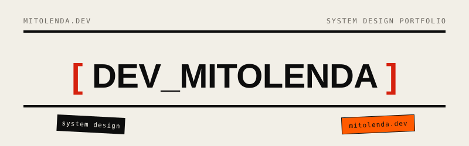

  

  <a href="README.md">🇺🇸 English</a> | <b>🇧🇷 Português</b> | <a href="README.es.md">🇪🇸 Español</a>

# [ DEV_MITOLENDA ]

> Eu construo sites, sistemas, APIs e automações voltados a problemas reais de negócios.

    

## 01 // SOBRE

<picture>
  <source media="(prefers-color-scheme: dark)" srcset="assets/rule-dark.svg">
  
</picture>

Atuo com desenvolvimento web, integrações e automação. Meu foco atual é transformar processos manuais em software sustentável, com documentação clara e um fluxo profissional no GitHub.

## 02 // TRABALHOS PÚBLICOS SELECIONADOS

<picture>
  <source media="(prefers-color-scheme: dark)" srcset="assets/rule-dark.svg">
  
</picture>

Estudos de caso do portfólio: telas reais de produto quando existem, diagramas de arquitetura verificados quando não existem, sem métricas inventadas.

### [Aurora CPM](https://mitolenda.dev/case-studies/cpm/index.html)

Pipeline comercial B2B com 11 etapas ponderadas. Forecast e temperatura do negócio saem do backend, sem digitação manual.

     

### [Solvia](https://mitolenda.dev/case-studies/seeds4y/index.html)

Diagnóstico agrícola que compara cada leitura de sensor com a faixa agronômica ideal da espécie e da idade do talhão, com um consultor de IA explicando o desvio enquanto a decisão fica com o humano.

     

### [Haven Link · Time Nexus](https://github.com/Mit0lenda/Nexus)

Projeto de equipe em 2024 para o Gênio Digital iTwin Brasil que centraliza o estoque com câmeras escaneando prateleiras e visão computacional. 3º lugar nacional, incubado no CEI-UFRGS.

    

> 📐 Mais estudos de caso (Nexus System, Sistema Jurídico, Contta, Obra Nav) em [mitolenda.dev](https://mitolenda.dev/).

## 03 // FERRAMENTAS

<picture>
  <source media="(prefers-color-scheme: dark)" srcset="assets/rule-dark.svg">
  
</picture>

         

## 04 // COMO EU TRABALHO

<picture>
  <source media="(prefers-color-scheme: dark)" srcset="assets/rule-dark.svg">
  
</picture>

- `01` Uma issue define o problema e os critérios de aceite.
- `02` Uma branch isola o trabalho.
- `03` Commits pequenos explicam a evolução.
- `04` Um pull request mostra o diff, os testes e os riscos.
- `05` Mudanças em produção exigem checklist de deploy e rollback.

### Precisa de um site, sistema ou automação?

`[ EOF ]`

